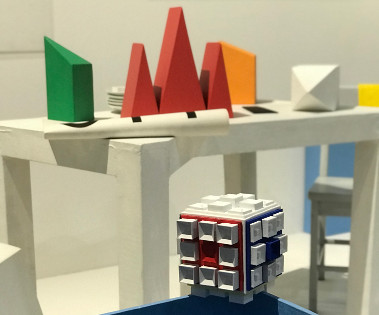
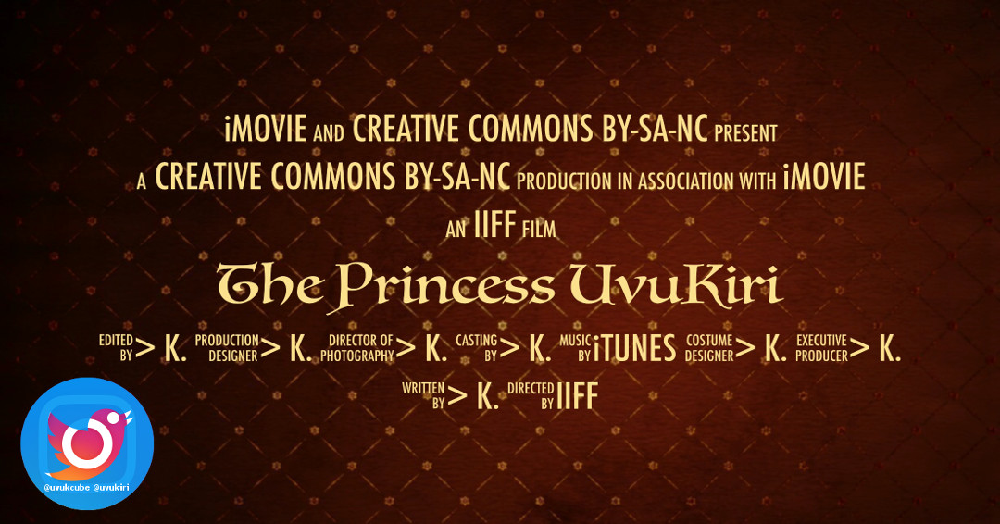

# UvuKiri

<p align="center" >
  
</p>

> UvuKiri, a learning support - fun to build for the children.

> Follow **@uvukiri** on Instagram and Twitter.

The Princess UvuKiri

Hi, my name is Princess UvuKiri, my friends call me UkI (You`Kee).

In team UvuKCube, my duty is to be ‘the model’.

Imagine a visually impaired children, with a Rubik’s cube in hands.

Princess You`Kee is the reference cube model for the starting and end position to enjoy the cube mouvements with or without eyes’ sight.

## What is the UvuKCube?

Imagine you could improve your mind path 3D modeler to move objects around in 3D Space.

Discover 3D Printing, Blender3D, even the documentation explains how to re-do a cube.

Cool Instagram video of [cubignons](https://instagram.com/p/BknzR3xnqnM/) being 3D printed. 

> A lot to learn 3D software BLENDER3D, 3D Printers, Cubignons PiK and LaK, concave, convex, painting, glue and a lot of fun to teach a blind child to master UvuKCube.

UvuKiri’s Cubignons PiK and LaK are Creative Commons, you are free to 3D print them, to modify them to create new UvuKCube.

Thanks to [La Cité des Sciences Fab Lab UvuKiri](http://carrefour-numerique.cite-sciences.fr/fablab/wiki/doku.php?id=projets:uvukiri)

Thanks to [La Cité des Sciences Fab Lab UvuKCube](http://carrefour-numerique.cite-sciences.fr/fablab/wiki/doku.php?id=projets:uvuk_cube)

``` bash
To follow the Cubignons PiK and LaK, and more
FB fb.me/uvukiri
FB fb.me/uvukcube
Instagram @uvukiri @uvukcube
Twitter @uvukiri @uvukcube
Email uvukiri@gmail.com

> K.
```

<p align="center" >
  
</p>

License Creative Commons (BY) (SA) (NC) https://creativecommons.org/licenses/by-nc/4.0/

Licence Creative Commons Français (BY) (SA) (NC) https://creativecommons.org/licenses/by-nc/4.0/deed.fr
